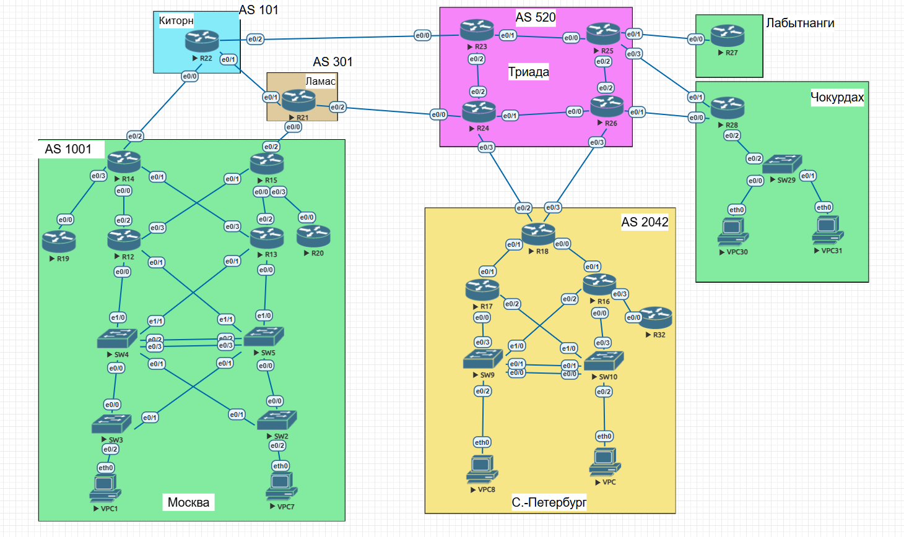
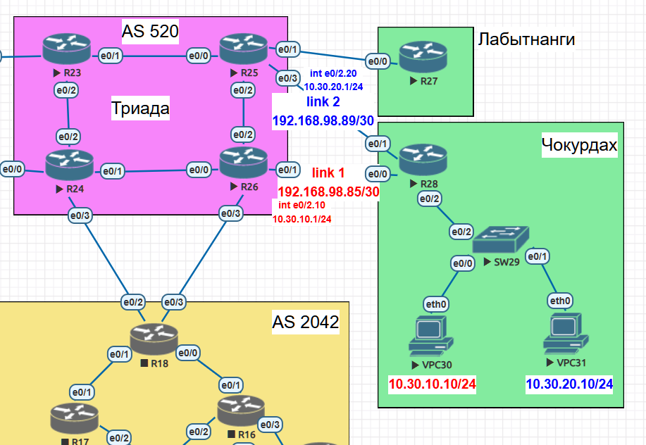

# Лабораторная работа: Policy-Based Routing (PBR) в офисе Чокурдах

## **Тема работы**  
Policy-Based Routing (PBR) и распределение трафика между линками

## **Цель:**  
Настроить политику маршрутизации в офисе Чокурдах и распределить трафик между двумя линками с провайдером.

## **Описание/Пошаговая инструкция выполнения домашнего задания:**  
В этой самостоятельной работе мы ожидаем, что вы самостоятельно:

1. Настроите политику маршрутизации для сетей офиса.
2. Распределите трафик между двумя линками с провайдером.
3. Настроите отслеживание линка через технологию IP SLA (только для IPv4).
4. Настройте для офиса Лабытнанги маршрут по умолчанию.
5. План работы и изменения зафиксированы в документации.

---

## **Общая топология сети**


## **Топология сети лабораторной №2**


### **Описание итоговой конфигурации:**

#### **Офис Чокурдах:**
- **R28** имеет два линка к провайдерам:
  - `Ethernet0/0`: P2P к R26 – `192.168.98.85/30`
  - `Ethernet0/1`: P2P к R25 – `192.168.98.89/30`
- **SW29** подключен к R28 через trunk (VLAN10, VLAN20, VLAN98, VLAN99)
- Клиентские сети:
  - VLAN10: `10.30.10.0/24` (VPC30: `10.30.10.10/24`, шлюз `10.30.10.1`)
  - VLAN20: `10.30.20.0/24` (VPC31: `10.30.20.10/24`, шлюз `10.30.20.1`)

#### **Провайдер Триада:**
- **R25**: 
  - E0/3: P2P к R28 – `192.168.98.90/30`
  - Loopback100: `8.8.8.8/32` (тестовый адрес)
  - E0/1: P2P к R27 – `192.168.98.94/30`
- **R26**: 
  - E0/1: P2P к R28 – `192.168.98.86/30`
  - Loopback100: `8.8.8.8/32` (тестовый адрес)

#### **Офис Лабытнанги:**
- **R27**: E0/0: P2P к R25 – `192.168.98.93/30`, default route на R25

---

## **План работы и реализация**

### **1. Настройка IP SLA для отслеживания линков на R28**

```cisco
ip sla 10
 icmp-echo 192.168.98.86 source-interface Ethernet0/0
 frequency 5
ip sla schedule 10 life forever start-time now

ip sla 20
 icmp-echo 192.168.98.90 source-interface Ethernet0/1
 frequency 5
ip sla schedule 20 life forever start-time now

track 10 ip sla 10 reachability
 delay down 10 up 5

track 20 ip sla 20 reachability
 delay down 10 up 5
```

### **2. Настройка политики маршрутизации (PBR) на R28**

**Важное решение:** Из-за особенности версии Cisco IOS (игнорирование порядка next-hop в одном route-map) используется **отдельный route-map для каждого VLAN**.

```cisco
! ACL для разделения трафика
access-list 101 permit ip 10.30.10.0 0.0.0.255 any
access-list 102 permit ip 10.30.20.0 0.0.0.255 any

! Route-map для VLAN10 - только через R26 (линк 1)
route-map PBR-VLAN10 permit 10
 match ip address 101
 set ip next-hop verify-availability 192.168.98.86 10 track 10

! Route-map для VLAN20 - только через R25 (линк 2)
route-map PBR-VLAN20 permit 10
 match ip address 102
 set ip next-hop verify-availability 192.168.98.90 20 track 20

! Route-map для остального трафика (балансировка)
route-map PBR-OTHER permit 10
 set ip next-hop verify-availability 192.168.98.86 10 track 10
 set ip next-hop verify-availability 192.168.98.90 20 track 20

! Применение к интерфейсам
interface Ethernet0/2.10
 ip policy route-map PBR-VLAN10

interface Ethernet0/2.20
 ip policy route-map PBR-VLAN20
```

### **3. Настройка статических маршрутов и NAT на R28**

```cisco
! NAT для VLAN10 - через интерфейс Ethernet0/0 (R26)
ip nat inside source list NAT_CLIENTS_VLAN_10 interface Ethernet0/0 overload
ip access-list extended NAT_CLIENTS_VLAN_10
 permit ip 10.30.10.0 0.0.0.255 any

! NAT для VLAN20 - через интерфейс Ethernet0/1 (R25)
ip nat inside source list NAT_CLIENTS_VLAN_20 interface Ethernet0/1 overload
ip access-list extended NAT_CLIENTS_VLAN_20
 permit ip 10.30.20.0 0.0.0.255 any

! Default route с отслеживанием линков
ip route 0.0.0.0 0.0.0.0 192.168.98.86 track 10
ip route 0.0.0.0 0.0.0.0 192.168.98.90 track 20
```

### **4. Настройка на стороне провайдера (R25, R26)**

#### **R25:**
```cisco
interface Loopback100
 description Test_Inet
 ip address 8.8.8.8 255.255.255.255

interface Ethernet0/1
 description P2P_R27
 ip address 192.168.98.94 255.255.255.252

interface Ethernet0/3
 description P2P_R28
 ip address 192.168.98.90 255.255.255.252
```

#### **R26:**
```cisco
interface Loopback100
 description Test_Inet
 ip address 8.8.8.8 255.255.255.255

interface Ethernet0/1
 description P2P_R28
 ip address 192.168.98.86 255.255.255.252
```

**Примечание:** Обратные маршруты к сетям Чокурдаха на R25 и R26 **не требуются**, так как трафик NATится на R28 и возвращается через тот же интерфейс, с которого пришел.

### **5. Настройка офиса Лабытнанги (R27)**

```cisco
ip route 0.0.0.0 0.0.0.0 192.168.98.94 name DEFAULT_TO_TRIADA
```

### **6. Настройка SW29**

```cisco
vlan 10
 name client_10
vlan 20
 name client_20
vlan 99
 name MGMT

interface Ethernet0/0
 switchport access vlan 10
 switchport mode access

interface Ethernet0/1
 switchport access vlan 20
 switchport mode access

interface Ethernet0/2
 description TO_R28
 switchport trunk encapsulation dot1q
 switchport mode trunk

interface Vlan99
 description MGMT
 ip address 192.168.99.29 255.255.255.0

ip default-gateway 192.168.99.253
```

---

## **Тестирование и проверка**

### **1. Проверка IP SLA и track объектов**

```cisco
R28#show ip sla statistics
IPSLA operation id: 10
        Latest RTT: 1 milliseconds
        Latest operation return code: OK
        Number of successes: 639
        Number of failures: 1

IPSLA operation id: 20
        Latest RTT: 1 milliseconds
        Latest operation return code: OK
        Number of successes: 639
        Number of failures: 1

R28#show track
Track 10
  IP SLA 10 reachability
  Reachability is Up
  Tracked by: Route Map 0, Static IP Routing 0

Track 20
  IP SLA 20 reachability
  Reachability is Up
  Tracked by: Route Map 0, Static IP Routing 0
```

**✅ Результат:** Оба линка мониторятся корректно.

### **2. Проверка PBR политик**

```cisco
R28#show route-map
route-map PBR-VLAN10, permit, sequence 10
  Match clauses: ip address (access-lists): 101
  Set clauses: ip next-hop verify-availability 192.168.98.86 10 track 10 [up]
  Policy routing matches: 25 packets, 2658 bytes

route-map PBR-VLAN20, permit, sequence 10
  Match clauses: ip address (access-lists): 102
  Set clauses: ip next-hop verify-availability 192.168.98.90 20 track 20 [up]
  Policy routing matches: 47 packets, 4942 bytes

route-map PBR-OTHER, permit, sequence 10
  Set clauses: ip next-hop verify-availability 192.168.98.86 10 track 10 [up]
               ip next-hop verify-availability 192.168.98.90 20 track 20 [up]
  Policy routing matches: 0 packets, 0 bytes
```

**✅ Результат:** PBR активен, трафик VLAN10 и VLAN20 распределяется на разные линки.

### **3. Проверка таблицы маршрутизации R28**

```cisco
R28#show ip route
Gateway of last resort is 192.168.98.90 to network 0.0.0.0

S*    0.0.0.0/0 [1/0] via 192.168.98.90
                [1/0] via 192.168.98.86
C        10.30.10.0/24 is directly connected, Ethernet0/2.10
C        10.30.20.0/24 is directly connected, Ethernet0/2.20
C        192.168.98.84/30 is directly connected, Ethernet0/0
C        192.168.98.88/30 is directly connected, Ethernet0/1
C        192.168.98.96/30 is directly connected, Ethernet0/2.98
```

**✅ Результат:** ECMP default route настроен, оба линка активны.

### **4. Проверка NAT трансляций**

```cisco
R28#show ip nat translations
Pro Inside global      Inside local       Outside local      Outside global
udp 192.168.98.85:24832 10.30.10.10:24832 8.8.8.8:24833      8.8.8.8:24833
icmp 192.168.98.85:44908 10.30.10.10:44908 8.8.8.8:44908     8.8.8.8:44908
udp 192.168.98.89:24944 10.30.20.10:24944 8.8.8.8:24945      8.8.8.8:24945
```

**✅ Результат:** 
- VLAN10 NATится через `192.168.98.85` (R26)
- VLAN20 NATится через `192.168.98.89` (R25)

### **5. Проверка связности клиентов**

#### **VPC30 (VLAN10):**
```bash
VPC30> ping 8.8.8.8
84 bytes from 8.8.8.8 icmp_seq=1 ttl=254 time=3.795 ms
84 bytes from 8.8.8.8 icmp_seq=2 ttl=254 time=5.541 ms
84 bytes from 8.8.8.8 icmp_seq=3 ttl=254 time=3.959 ms
84 bytes from 8.8.8.8 icmp_seq=4 ttl=254 time=3.045 ms
84 bytes from 8.8.8.8 icmp_seq=5 ttl=254 time=3.416 ms

VPC30> trace 8.8.8.8
trace to 8.8.8.8, 8 hops max
 1   10.30.10.1   7.218 ms  7.814 ms  1.609 ms
 2   *192.168.98.86   3.449 ms
```

#### **VPC31 (VLAN20):**
```bash
VPC31> ping 8.8.8.8
84 bytes from 8.8.8.8 icmp_seq=1 ttl=254 time=3.016 ms
84 bytes from 8.8.8.8 icmp_seq=2 ttl=254 time=5.006 ms
84 bytes from 8.8.8.8 icmp_seq=3 ttl=254 time=3.129 ms
84 bytes from 8.8.8.8 icmp_seq=4 ttl=254 time=2.997 ms
84 bytes from 8.8.8.8 icmp_seq=5 ttl=254 time=3.493 ms

VPC31> trace 8.8.8.8
trace to 8.8.8.8, 8 hops max
 1   10.30.20.1   3.865 ms  2.195 ms  2.188 ms
 2   *192.168.98.90   4.207 ms
```

**✅ Результат:** 
- **VLAN10** → через R26 (`192.168.98.86`)
- **VLAN20** → через R25 (`192.168.98.90`)


### **6. Проверка R27**

```cisco
R27#show ip route
Gateway of last resort is 192.168.98.94 to network 0.0.0.0

S*    0.0.0.0/0 [1/0] via 192.168.98.94
C        192.168.98.92/30 is directly connected, Ethernet0/0

R27#ping 192.168.98.94
!!!!!
Success rate is 100 percent (5/5)
```

**✅ Результат:** Default route на R25 работает.

