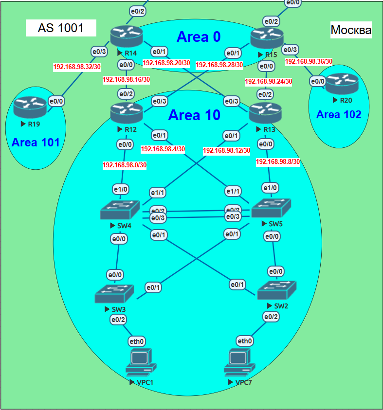

# Лабораторная работа: OSPF в офисе Москва

## **Тема работы**
Настройка OSPF, разделение сети на Area и фильтрация маршрутов

## **Цель:**
Настроить OSPF в офисе Москва, разделить сеть на Area, настроить фильтрацию между Area.

## **Описание/Пошаговая инструкция выполнения домашнего задания:**

1. Настроить OSPF в офисе Москва
2. Разделить сеть на Area
3. Настроить фильтрацию между Area
4. Настроить получение маршрута по умолчанию для Area 10, 101 и 102
5. Настроить HSRP между SW4 и SW5 для отказоустойчивости клиентских шлюзов
6. Настроить EtherChannel между SW4 и SW5 для увеличения пропускной способности
7. План работы и изменения зафиксированы в документации
8. Настройка для IPv6 повторяет логику IPv4

---

## **Общая топология сети**


## **Топология сети лабораторной №3**



### **Участники и их роли:**

| Устройство | Роль | Area OSPF |
|------------|------|-----------|
| R14, R15 | ABR (Area Border Router), Backbone | Area 0 |
| R12, R13 | ABR | Area 10 |
| R19 | Stub-роутер | Area 101 |
| R20 | Обычный роутер | Area 102 |
| SW4, SW5 | L3 свитчи, HSRP, EtherChannel, клиентские шлюзы | Area 10 |
| VPC1, VPC7 | Клиенты | - |

### **IP-адресация (IPv4):**

| Сеть | Назначение |
|------|------------|
| 10.10.10.0/24 | Клиентская VLAN10 (VPC1) |
| 10.10.20.0/24 | Клиентская VLAN20 (VPC7) |
| 10.101.1.0/24 | Тестовая сеть Area 101 (Loopback101 R19) |
| 10.101.2.0/24 | Тестовая сеть Area 101 (Loopback102 R19) |
| 192.168.98.0/30 | R12-SW4 |
| 192.168.98.4/30 | R12-SW5 |
| 192.168.98.8/30 | R13-SW5 |
| 192.168.98.12/30 | R13-SW4 |
| 192.168.98.16/30 | R14-R12 |
| 192.168.98.20/30 | R14-R13 |
| 192.168.98.24/30 | R15-R13 |
| 192.168.98.28/30 | R15-R12 |
| 192.168.98.32/30 | R14-R19 |
| 192.168.98.36/30 | R15-R20 |
| 192.168.99.0/24 | MGMT VRF |

---

## **План работы и реализация**

### **1. Настройка OSPF на маршрутизаторах**

#### **1.1. R14 (Area 0 + ABR для Area 101)**

```cisco
!
interface Ethernet0/0
 description P2P_R12
 ip address 192.168.98.18 255.255.255.252
 ip ospf network point-to-point
 ip ospf 1 area 0
!
interface Ethernet0/1
 description P2P_R13
 ip address 192.168.98.22 255.255.255.252
 ip ospf network point-to-point
 ip ospf 1 area 0
!
interface Ethernet0/3
 description P2P_R19
 ip address 192.168.98.34 255.255.255.252
 ip ospf network point-to-point
 ip ospf 1 area 101
!
router ospf 1
 router-id 14.14.14.14
 log-adjacency-changes
 area 101 stub no-summary
 area 101 filter-list prefix BLOCK_AREA101 out
 default-information originate always
 network 192.168.98.16 0.0.0.3 area 0
 network 192.168.98.20 0.0.0.3 area 0
 network 192.168.98.32 0.0.0.3 area 101
!
ip prefix-list BLOCK_AREA101 seq 5 deny 10.101.1.0/24
ip prefix-list BLOCK_AREA101 seq 10 deny 10.101.2.0/24
ip prefix-list BLOCK_AREA101 seq 15 permit 0.0.0.0/0 le 32
!
```

#### **1.2. R15 (Area 0 + ABR для Area 102)**

```cisco
!
interface Ethernet0/0
 description P2P_R13
 ip address 192.168.98.26 255.255.255.252
 ip ospf network point-to-point
 ip ospf 1 area 0
!
interface Ethernet0/1
 description P2P_R12
 ip address 192.168.98.30 255.255.255.252
 ip ospf network point-to-point
 ip ospf 1 area 0
!
interface Ethernet0/3
 description P2P_R20
 ip address 192.168.98.38 255.255.255.252
 ip ospf network point-to-point
 ip ospf 1 area 102
!
router ospf 1
 router-id 15.15.15.15
 log-adjacency-changes
 default-information originate always
 network 192.168.98.24 0.0.0.3 area 0
 network 192.168.98.28 0.0.0.3 area 0
 network 192.168.98.36 0.0.0.3 area 102
!
```

#### **1.3. R12 (Area 10 - Stub, получает default)**

```cisco
!
interface Ethernet0/0.98
 description P2P_SW4
 encapsulation dot1Q 98
 ip address 192.168.98.1 255.255.255.252
 ip ospf network point-to-point
 ip ospf 1 area 10
!
interface Ethernet0/1.97
 description P2P_SW5
 encapsulation dot1Q 97
 ip address 192.168.98.5 255.255.255.252
 ip ospf network point-to-point
 ip ospf 1 area 10
!
interface Ethernet0/2
 description P2P_R14
 ip address 192.168.98.17 255.255.255.252
 ip ospf network point-to-point
 ip ospf 1 area 0
!
interface Ethernet0/3
 description P2P_R15
 ip address 192.168.98.29 255.255.255.252
 ip ospf network point-to-point
 ip ospf 1 area 0
!
router ospf 1
 router-id 12.12.12.12
 log-adjacency-changes
 area 10 stub no-summary
 network 192.168.98.0 0.0.0.3 area 10
 network 192.168.98.4 0.0.0.3 area 10
 network 192.168.98.16 0.0.0.3 area 0
 network 192.168.98.28 0.0.0.3 area 0
!
```

#### **1.4. R13 (Area 10 - Stub, получает default)**

```cisco
!
interface Ethernet0/0.96
 description P2P_SW5
 encapsulation dot1Q 96
 ip address 192.168.98.9 255.255.255.252
 ip ospf network point-to-point
 ip ospf 1 area 10
!
interface Ethernet0/1.95
 description P2P_SW4
 encapsulation dot1Q 95
 ip address 192.168.98.13 255.255.255.252
 ip ospf network point-to-point
 ip ospf 1 area 10
!
interface Ethernet0/2
 description P2P_R15
 ip address 192.168.98.25 255.255.255.252
 ip ospf network point-to-point
 ip ospf 1 area 0
!
interface Ethernet0/3
 description P2P_R14
 ip address 192.168.98.21 255.255.255.252
 ip ospf network point-to-point
 ip ospf 1 area 0
!
router ospf 1
 router-id 13.13.13.13
 log-adjacency-changes
 area 10 stub no-summary
 network 192.168.98.8 0.0.0.3 area 10
 network 192.168.98.12 0.0.0.3 area 10
 network 192.168.98.24 0.0.0.3 area 0
 network 192.168.98.20 0.0.0.3 area 0
!
```

#### **1.5. R19 (Area 101 - только default + тестовые сети)**

```cisco
!
interface Loopback101
 description TEST_NET_AREA101
 ip address 10.101.1.1 255.255.255.0
 ip ospf network point-to-point
 ip ospf 1 area 101
!
interface Loopback102
 description TEST_NET_AREA101
 ip address 10.101.2.1 255.255.255.0
 ip ospf network point-to-point
 ip ospf 1 area 101
!
interface Ethernet0/0
 description P2P_R14
 ip address 192.168.98.33 255.255.255.252
 ip ospf network point-to-point
 ip ospf 1 area 101
!
router ospf 1
 router-id 19.19.19.19
 log-adjacency-changes
 area 101 stub
 network 192.168.98.32 0.0.0.3 area 101
!
```

#### **1.6. R20 (Area 102 - без фильтра, фильтрация на R14)**

```cisco
!
interface Ethernet0/0
 description P2P_R15
 ip address 192.168.98.37 255.255.255.252
 ip ospf network point-to-point
 ip ospf 1 area 102
!
router ospf 1
 router-id 20.20.20.20
 network 192.168.98.36 0.0.0.3 area 102
!
```

---

### **2. Настройка SW4 и SW5**

#### **2.1. EtherChannel между SW4 и SW5**

**SW4:**
```cisco
interface port-channel 1
 switchport trunk encapsulation dot1q
 switchport mode trunk
!
interface range ethernet0/2-3
 channel-group 1 mode active
```

**SW5:**
```cisco
interface port-channel 1
 switchport trunk encapsulation dot1q
 switchport mode trunk
!
interface range ethernet0/2-3
 channel-group 1 mode active
```

#### **2.2. Включение IP routing и OSPF на SW4**

```cisco
ip routing
!
router ospf 1
 router-id 4.4.4.4
 network 10.10.10.0 0.0.0.255 area 10
 network 10.10.20.0 0.0.0.255 area 10
 network 192.168.98.0 0.0.0.3 area 10
 network 192.168.98.12 0.0.0.3 area 10
```

#### **2.3. Включение IP routing и OSPF на SW5**

```cisco
ip routing
!
router ospf 1
 router-id 5.5.5.5
 network 10.10.10.0 0.0.0.255 area 10
 network 10.10.20.0 0.0.0.255 area 10
 network 192.168.98.4 0.0.0.3 area 10
 network 192.168.98.8 0.0.0.3 area 10
```

#### **2.4. HSRP на SW4 и SW5**

**SW4 (Primary):**
```cisco
interface vlan10
 standby 10 ip 10.10.10.254
 standby 10 priority 150
 standby 10 preempt
!
interface vlan20
 standby 20 ip 10.10.20.254
 standby 20 priority 150
 standby 20 preempt
```

**SW5 (Backup):**
```cisco
interface vlan10
 standby 10 ip 10.10.10.254
 standby 10 priority 100
 standby 10 preempt
!
interface vlan20
 standby 20 ip 10.10.20.254
 standby 20 priority 100
 standby 20 preempt
```

---

### **3. Настройка клиентов**

**VPC1:**
```bash
ip 10.10.10.10/24 10.10.10.254
```

**VPC7:**
```bash
ip 10.10.20.10/24 10.10.20.254
```

---

## **Тестирование и проверка**

### **4.1. Проверка OSPF соседств**

```cisco
R14#show ip ospf neighbor
Neighbor ID     Pri   State           Dead Time   Address         Interface
13.13.13.13       1   FULL/BDR        00:00:34    192.168.98.21   Ethernet0/1
12.12.12.12       1   FULL/BDR        00:00:33    192.168.98.17   Ethernet0/0
```

```cisco
R15#show ip ospf neighbor
Neighbor ID     Pri   State           Dead Time   Address         Interface
12.12.12.12       1   FULL/BDR        00:00:33    192.168.98.29   Ethernet0/1
13.13.13.13       1   FULL/BDR        00:00:33    192.168.98.25   Ethernet0/0
20.20.20.20       1   FULL/BDR        00:00:31    192.168.98.37   Ethernet0/3
```

```cisco
R19#show ip ospf neighbor
Neighbor ID     Pri   State           Dead Time   Address         Interface
14.14.14.14       0   FULL/  -        00:00:33    192.168.98.34   Ethernet0/0
```

**✅ Результат:** Все OSPF соседства установлены.

---

### **4.2. Проверка получения default маршрута**

**R12:**
```cisco
R12#show ip route ospf | include 0.0.0.0
Gateway of last resort is 192.168.98.30 to network 0.0.0.0
O*E2  0.0.0.0/0 [110/1] via 192.168.98.30, 00:15:02, Ethernet0/3
```

**R13:**
```cisco
R13#show ip route ospf | include 0.0.0.0
Gateway of last resort is 192.168.98.26 to network 0.0.0.0
O*E2  0.0.0.0/0 [110/1] via 192.168.98.26, 00:14:36, Ethernet0/2
```

**✅ Результат:** R12 и R13 получают маршрут по умолчанию.

---

### **4.3. Проверка R19 (только default маршрут)**

```cisco
R19#show ip route ospf
Gateway of last resort is 192.168.98.34 to network 0.0.0.0

O*IA  0.0.0.0/0 [110/11] via 192.168.98.34, 00:25:10, Ethernet0/0
```

**✅ Результат:** R19 получает только default маршрут (тестовые сети 10.101.1.0/24 и 10.101.2.0/24 не покидают Area 101).

---

### **4.4. Проверка фильтрации на R14 (маршруты Area 101 не попадают в Area 0)**

```cisco
R14#show ip route ospf | include 10.101.
(пусто - маршруты заблокированы фильтром на исходящие LSA из Area 101)
```

**✅ Результат:** Фильтр `area 101 filter-list prefix BLOCK_AREA101 out` блокирует передачу сетей Area 101 в Area 0.

---

### **4.5. Проверка R20 (не получает маршруты Area 101)**

```cisco
R20#show ip route ospf | include 10.101.
(пусто)

R20#show ip route ospf
Gateway of last resort is 192.168.98.38 to network 0.0.0.0

O*E2  0.0.0.0/0 [110/1] via 192.168.98.38, 00:45:09, Ethernet0/0
      192.168.98.0/24 is variably subnetted, 11 subnets, 2 masks
O IA     192.168.98.0/30 [110/30] via 192.168.98.38, 00:45:09, Ethernet0/0
O IA     192.168.98.4/30 [110/30] via 192.168.98.38, 00:45:09, Ethernet0/0
O IA     192.168.98.8/30 [110/30] via 192.168.98.38, 00:45:09, Ethernet0/0
O IA     192.168.98.12/30 [110/30] via 192.168.98.38, 00:45:09, Ethernet0/0
O IA     192.168.98.16/30 [110/30] via 192.168.98.38, 00:45:09, Ethernet0/0
O IA     192.168.98.20/30 [110/30] via 192.168.98.38, 00:45:09, Ethernet0/0
O IA     192.168.98.24/30 [110/20] via 192.168.98.38, 00:45:09, Ethernet0/0
O IA     192.168.98.28/30 [110/20] via 192.168.98.38, 00:45:09, Ethernet0/0
O IA     192.168.98.32/30 [110/40] via 192.168.98.38, 00:24:20, Ethernet0/0
```

**✅ Результат:** R20 не получает маршруты Area 101 (10.101.1.0/24 и 10.101.2.0/24).

---

### **4.6. Проверка EtherChannel**

```cisco
SW4#show etherchannel summary
Group  Port-channel  Protocol    Ports
------+-------------+-----------+-----------------------------------------------
1      Po1(SU)         LACP      Et0/2(P)    Et0/3(P)

SW5#show etherchannel summary
Group  Port-channel  Protocol    Ports
------+-------------+-----------+-----------------------------------------------
1      Po1(SU)         LACP      Et0/2(P)    Et0/3(P)
```

**✅ Результат:** EtherChannel работает, оба порта в bundled состоянии.

---

### **4.7. Проверка HSRP**

```cisco
SW4#show standby brief
Interface   Grp  Pri P State   Active          Standby         Virtual IP
Vl10        10   150 P Active  local           10.10.10.2      10.10.10.254
Vl20        20   150 P Active  local           10.10.20.2      10.10.20.254

SW5#show standby brief
Interface   Grp  Pri P State   Active          Standby         Virtual IP
Vl10        10   100 P Standby 10.10.10.1      local           10.10.10.254
Vl20        20   100 P Standby 10.10.20.1      local           10.10.20.254
```

**✅ Результат:** SW4 Active, SW5 Standby.

---

### **4.8. Проверка связности клиентов**

**VPC1 → HSRP виртуальный IP:**
```bash
VPC1> ping 10.10.10.254
84 bytes from 10.10.10.254 icmp_seq=1 ttl=255 time=1.168 ms
84 bytes from 10.10.10.254 icmp_seq=2 ttl=255 time=3.437 ms
84 bytes from 10.10.10.254 icmp_seq=3 ttl=255 time=1.177 ms
```

**VPC1 → VPC7:**
```bash
VPC1> ping 10.10.20.10
84 bytes from 10.10.20.10 icmp_seq=1 ttl=63 time=4.860 ms
84 bytes from 10.10.20.10 icmp_seq=2 ttl=63 time=3.329 ms
84 bytes from 10.10.20.10 icmp_seq=3 ttl=63 time=4.251 ms
```

**✅ Результат:** Клиенты имеют связность между собой и с HSRP виртуальным шлюзом.

---

## **Выводы**

В ходе лабораторной работы были выполнены следующие задачи:

1. ✅ **OSPF настроен** — Area 0 (R14,R15), Area 10 (R12,R13), Area 101 (R19), Area 102 (R20)
2. ✅ **R12/R13 получают default** (area 10 stub no-summary)
3. ✅ **R19 получает только default** (area 101 stub)
4. ✅ **Фильтрация между Area** — на R14 настроен фильтр `area 101 filter-list prefix BLOCK_AREA101 out`, блокирующий передачу сетей Area 101 в Area 0
5. ✅ **R20 не получает маршруты Area 101** (благодаря фильтрации на R14)
6. ✅ **EtherChannel между SW4 и SW5** настроен и работает
7. ✅ **HSRP между SW4 и SW5** настроен (SW4 Active, SW5 Standby)
8. ✅ **Клиенты имеют связность** через HSRP виртуальный шлюз

---
## Настройка OSPFv3 (IPv6)

Настройка для IPv6 полностью повторяет логику IPv4. Ниже приведены полные конфигурации OSPFv3 для всех устройств.

---

### IPv6 адресация

| Сеть | Назначение |
|------|------------|
| 2001:DB8:10:10::/64 | Клиентская VLAN10 (VPC1) |
| 2001:DB8:10:20::/64 | Клиентская VLAN20 (VPC7) |
| 2001:DB8:101:1::/64 | Тестовая сеть Area 101 (Loopback101 R19) |
| 2001:DB8:101:2::/64 | Тестовая сеть Area 101 (Loopback102 R19) |
| 2001:DB8:98::/64 | R12-SW4 |
| 2001:DB8:98:4::/64 | R12-SW5 |
| 2001:DB8:98:8::/64 | R13-SW5 |
| 2001:DB8:98:12::/64 | R13-SW4 |
| 2001:DB8:98:16::/64 | R14-R12 |
| 2001:DB8:98:20::/64 | R14-R13 |
| 2001:DB8:98:24::/64 | R15-R13 |
| 2001:DB8:98:28::/64 | R15-R12 |
| 2001:DB8:98:32::/64 | R14-R19 |
| 2001:DB8:98:36::/64 | R15-R20 |

---

### Настройка OSPFv3 на маршрутизаторах

#### R14 (Area 0 + ABR для Area 101) - IPv6

```cisco
ipv6 unicast-routing
!
interface Ethernet0/0
 description P2P_R12
 ipv6 address 2001:DB8:98:16::2/64
 ipv6 ospf network point-to-point
 ipv6 ospf 1 area 0
!
interface Ethernet0/1
 description P2P_R13
 ipv6 address 2001:DB8:98:20::2/64
 ipv6 ospf network point-to-point
 ipv6 ospf 1 area 0
!
interface Ethernet0/3
 description P2P_R19
 ipv6 address 2001:DB8:98:32::2/64
 ipv6 ospf network point-to-point
 ipv6 ospf 1 area 101
!
ipv6 router ospf 1
 router-id 14.14.14.14
 area 101 stub no-summary
 area 101 filter-list prefix BLOCK_AREA101 out
 default-information originate always
!
ipv6 prefix-list BLOCK_AREA101 seq 5 deny 2001:DB8:101:1::/64
ipv6 prefix-list BLOCK_AREA101 seq 10 deny 2001:DB8:101:2::/64
ipv6 prefix-list BLOCK_AREA101 seq 15 permit ::/0 le 128
```

#### R15 (Area 0 + ABR для Area 102) - IPv6

```cisco
ipv6 unicast-routing
!
interface Ethernet0/0
 description P2P_R13
 ipv6 address 2001:DB8:98:24::2/64
 ipv6 ospf network point-to-point
 ipv6 ospf 1 area 0
!
interface Ethernet0/1
 description P2P_R12
 ipv6 address 2001:DB8:98:28::2/64
 ipv6 ospf network point-to-point
 ipv6 ospf 1 area 0
!
interface Ethernet0/3
 description P2P_R20
 ipv6 address 2001:DB8:98:36::2/64
 ipv6 ospf network point-to-point
 ipv6 ospf 1 area 102
!
ipv6 router ospf 1
 router-id 15.15.15.15
 default-information originate always
```

#### R12 (Area 10 - Stub, получает default) - IPv6

```cisco
ipv6 unicast-routing
!
interface Ethernet0/0.98
 description P2P_SW4
 encapsulation dot1Q 98
 ipv6 address 2001:DB8:98::1/64
 ipv6 ospf network point-to-point
 ipv6 ospf 1 area 10
!
interface Ethernet0/1.97
 description P2P_SW5
 encapsulation dot1Q 97
 ipv6 address 2001:DB8:98:4::1/64
 ipv6 ospf network point-to-point
 ipv6 ospf 1 area 10
!
interface Ethernet0/2
 description P2P_R14
 ipv6 address 2001:DB8:98:16::1/64
 ipv6 ospf network point-to-point
 ipv6 ospf 1 area 0
!
interface Ethernet0/3
 description P2P_R15
 ipv6 address 2001:DB8:98:28::1/64
 ipv6 ospf network point-to-point
 ipv6 ospf 1 area 0
!
ipv6 router ospf 1
 router-id 12.12.12.12
 area 10 stub no-summary
```

#### R13 (Area 10 - Stub, получает default) - IPv6

```cisco
ipv6 unicast-routing
!
interface Ethernet0/0.96
 description P2P_SW5
 encapsulation dot1Q 96
 ipv6 address 2001:DB8:98:8::1/64
 ipv6 ospf network point-to-point
 ipv6 ospf 1 area 10
!
interface Ethernet0/1.95
 description P2P_SW4
 encapsulation dot1Q 95
 ipv6 address 2001:DB8:98:12::1/64
 ipv6 ospf network point-to-point
 ipv6 ospf 1 area 10
!
interface Ethernet0/2
 description P2P_R15
 ipv6 address 2001:DB8:98:24::1/64
 ipv6 ospf network point-to-point
 ipv6 ospf 1 area 0
!
interface Ethernet0/3
 description P2P_R14
 ipv6 address 2001:DB8:98:20::1/64
 ipv6 ospf network point-to-point
 ipv6 ospf 1 area 0
!
ipv6 router ospf 1
 router-id 13.13.13.13
 area 10 stub no-summary
```

#### R19 (Area 101 - только default + тестовые сети) - IPv6

```cisco
ipv6 unicast-routing
!
interface Loopback101
 description TEST_NET_AREA101
 ipv6 address 2001:DB8:101:1::1/64
 ipv6 ospf network point-to-point
 ipv6 ospf 1 area 101
!
interface Loopback102
 description TEST_NET_AREA101
 ipv6 address 2001:DB8:101:2::1/64
 ipv6 ospf network point-to-point
 ipv6 ospf 1 area 101
!
interface Ethernet0/0
 description P2P_R14
 ipv6 address 2001:DB8:98:32::1/64
 ipv6 ospf network point-to-point
 ipv6 ospf 1 area 101
!
ipv6 router ospf 1
 router-id 19.19.19.19
 area 101 stub
```

#### R20 (Area 102) - IPv6

```cisco
ipv6 unicast-routing
!
interface Ethernet0/0
 description P2P_R15
 ipv6 address 2001:DB8:98:36::1/64
 ipv6 ospf network point-to-point
 ipv6 ospf 1 area 102
!
ipv6 router ospf 1
 router-id 20.20.20.20
```

---

### Настройка OSPFv3 на SW4 и SW5

**SW4:**
```cisco
ipv6 unicast-routing
!
interface Vlan10
 description client_10_gw
 ipv6 address 2001:DB8:10:10::1/64
 ipv6 ospf 1 area 10
!
interface Vlan20
 description client_20_gw
 ipv6 address 2001:DB8:10:20::1/64
 ipv6 ospf 1 area 10
!
interface Vlan95
 description P2P_R13
 ipv6 address 2001:DB8:98:12::2/64
 ipv6 ospf 1 area 10
!
interface Vlan98
 description P2P_R12
 ipv6 address 2001:DB8:98::2/64
 ipv6 ospf 1 area 10
!
ipv6 router ospf 1
 router-id 4.4.4.4
```

**SW5:**
```cisco
ipv6 unicast-routing
!
interface Vlan10
 description client_10_gw
 ipv6 address 2001:DB8:10:10::2/64
 ipv6 ospf 1 area 10
!
interface Vlan20
 description client_20_gw
 ipv6 address 2001:DB8:10:20::2/64
 ipv6 ospf 1 area 10
!
interface Vlan96
 description P2P_R13
 ipv6 address 2001:DB8:98:8::2/64
 ipv6 ospf 1 area 10
!
interface Vlan97
 description P2P_R12
 ipv6 address 2001:DB8:98:4::2/64
 ipv6 ospf 1 area 10
!
ipv6 router ospf 1
 router-id 5.5.5.5
```

---

### Настройка клиентов IPv6

**VPC1:**
```bash
ip 2001:db8:10:10::10/64 2001:db8:10:10::1
```

**VPC7:**
```bash
ip 2001:db8:10:20::10/64 2001:db8:10:20::1
```

---

### Проверка OSPFv3

**Проверка соседств:**
```cisco
R14#show ipv6 ospf neighbor
Neighbor ID     Pri   State           Dead Time   Interface ID    Interface
13.13.13.13       0   FULL/  -        00:00:35    6               Ethernet0/1
12.12.12.12       0   FULL/  -        00:00:35    5               Ethernet0/0
19.19.19.19       0   FULL/  -        00:00:32    3               Ethernet0/3
```

```cisco
R15#show ipv6 ospf neighbor
Neighbor ID     Pri   State           Dead Time   Interface ID    Interface
12.12.12.12       0   FULL/  -        00:00:37    6               Ethernet0/1
13.13.13.13       0   FULL/  -        00:00:38    5               Ethernet0/0
20.20.20.20       0   FULL/  -        00:00:32    3               Ethernet0/3
```

```cisco
SW4#show ipv6 ospf neighbor
Neighbor ID     Pri   State           Dead Time   Interface ID    Interface
5.5.5.5           1   FULL/BDR        00:00:37    12              Vlan20
5.5.5.5           1   FULL/BDR        00:00:39    11              Vlan10
```

**Проверка default маршрута на R12/R13:**
```cisco
R12#show ipv6 route ospf
OE2 ::/0 [110/1], tag 1
     via FE80::A8BB:CCFF:FE00:F010, Ethernet0/3
     via FE80::A8BB:CCFF:FE00:E000, Ethernet0/2
```

**Проверка R19 (только default):**
```cisco
R19#show ipv6 route ospf
OI  ::/0 [110/11]
     via FE80::A8BB:CCFF:FE00:E030, Ethernet0/0
```

**Проверка фильтрации на R14:**
```cisco
R14#show ipv6 route ospf | include 2001:DB8:101
(пусто)
```

**Проверка R20 (не получает маршруты Area 101):**
```cisco
R20#show ipv6 route ospf | include 2001:DB8:101
(пусто)
```

**Проверка связности клиентов IPv6:**
```bash
VPC1> ping 2001:db8:10:10::1
2001:db8:10:10::1 icmp6_seq=1 ttl=64 time=2.203 ms
2001:db8:10:10::1 icmp6_seq=2 ttl=64 time=1.377 ms

VPC1> ping 2001:db8:10:20::10
2001:db8:10:20::10 icmp6_seq=1 ttl=62 time=7.316 ms
2001:db8:10:20::10 icmp6_seq=2 ttl=62 time=6.866 ms
```

**✅ Результат:** Все задачи для IPv6 выполнены, логика полностью повторяет IPv4.