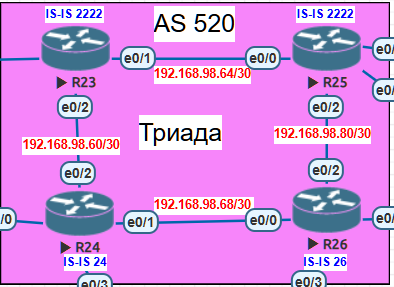

# Лабораторная работа: IS-IS в офисе Триада

## **Тема работы**
Настройка IS-IS, разделение сети на зоны

## **Цель:**
1. Настроить IS-IS в ISP Триада
2. R23 и R25 находятся в зоне 2222
3. R24 находится в зоне 24
4. R26 находится в зоне 26
5. Настройка IS-IS для IPv6

---

## **Общая топология сети**


## **Топология сети лабораторной №4**



### **Участники и их роли:**

| Устройство | Зона IS-IS |
|------------|------------|
| R23 | 2222 |
| R24 | 24 |
| R25 | 2222 |
| R26 | 26 |

### **Сети между роутерами:**

| Сеть | Между |
|------|-------|
| 192.168.98.60/30 | R23 - R24 |
| 192.168.98.64/30 | R23 - R25 |
| 192.168.98.68/30 | R24 - R26 |
| 192.168.98.80/30 | R25 - R26 |

---

## **План работы и реализация**

### **1. Настройка IS-IS на маршрутизаторах**

#### **1.1. R23 (зона 2222)**

```cisco
router isis
 net 49.2222.0000.0000.0023.00
 is-type level-2-only
!
interface Ethernet0/1
 description P2P_R25
 ip address 192.168.98.65 255.255.255.252
 ip router isis
 isis circuit-type level-2-only
!
interface Ethernet0/2
 description P2P_R24
 ip address 192.168.98.62 255.255.255.252
 ip router isis
 isis circuit-type level-2-only
```

#### **1.2. R24 (зона 24)**

```cisco
router isis
 net 49.0024.0000.0000.0024.00
 is-type level-2-only
!
interface Ethernet0/1
 description P2P_R26
 ip address 192.168.98.69 255.255.255.252
 ip router isis
 isis circuit-type level-2-only
!
interface Ethernet0/2
 description P2P_R23
 ip address 192.168.98.61 255.255.255.252
 ip router isis
 isis circuit-type level-2-only
!
interface Ethernet0/3
 description P2P_R18
 ip address 192.168.98.74 255.255.255.252
 ip router isis
 isis circuit-type level-2-only
```

#### **1.3. R25 (зона 2222)**

```cisco
router isis
 net 49.2222.0000.0000.0025.00
 is-type level-2-only
!
interface Ethernet0/0
 description P2P_R23
 ip address 192.168.98.66 255.255.255.252
 ip router isis
 isis circuit-type level-2-only
!
interface Ethernet0/1
 description P2P_R27
 ip address 192.168.98.94 255.255.255.252
 ip router isis
 isis circuit-type level-2-only
!
interface Ethernet0/2
 description P2P_R26
 ip address 192.168.98.82 255.255.255.252
 ip router isis
 isis circuit-type level-2-only
!
interface Ethernet0/3
 description P2P_R28
 ip address 192.168.98.90 255.255.255.252
 ip router isis
 isis circuit-type level-2-only
```

#### **1.4. R26 (зона 26)**

```cisco
router isis
 net 49.0026.0000.0000.0026.00
 is-type level-2-only
!
interface Ethernet0/0
 description P2P_R24
 ip address 192.168.98.70 255.255.255.252
 ip router isis
 isis circuit-type level-2-only
!
interface Ethernet0/1
 description P2P_R28
 ip address 192.168.98.86 255.255.255.252
 ip router isis
 isis circuit-type level-2-only
!
interface Ethernet0/2
 description P2P_R25
 ip address 192.168.98.81 255.255.255.252
 ip router isis
 isis circuit-type level-2-only
!
interface Ethernet0/3
 description P2P_R18
 ip address 192.168.98.78 255.255.255.252
 ip router isis
 isis circuit-type level-2-only
```

---

## **Тестирование и проверка**

### **4.1. Проверка IS-IS соседств**

**R23:**
```cisco
R23#show isis neighbors

System Id      Type Interface   IP Address      State Holdtime Circuit Id
R24            L2   Et0/2       192.168.98.61   UP    9        R24.02
R25            L2   Et0/1       192.168.98.66   UP    9        R25.01
```

**R24:**
```cisco
R24#show isis neighbors

System Id      Type Interface   IP Address      State Holdtime Circuit Id
R23            L2   Et0/2       192.168.98.62   UP    26       R24.02
R26            L2   Et0/1       192.168.98.70   UP    7        R26.01
```

**R25:**
```cisco
R25#show isis neighbors

System Id      Type Interface   IP Address      State Holdtime Circuit Id
R23            L2   Et0/0       192.168.98.65   UP    22       R25.01
R26            L2   Et0/2       192.168.98.81   UP    7        R26.03
```

**R26:**
```cisco
R26#show isis neighbors

System Id      Type Interface   IP Address      State Holdtime Circuit Id
R24            L2   Et0/0       192.168.98.69   UP    29       R26.01
R25            L2   Et0/2       192.168.98.82   UP    26       R26.03
```

**✅ Результат:** Все IS-IS соседства установлены в состоянии UP.

---

### **4.2. Проверка топологии IS-IS**

**R23:**
```cisco
R23#show isis topology

IS-IS TID 0 paths to level-2 routers
System Id            Metric     Next-Hop             Interface   SNPA
R23                  --
R24                  10         R24                  Et0/2       aabb.cc01.8020
R25                  10         R25                  Et0/1       aabb.cc01.9000
R26                  20         R24                  Et0/2       aabb.cc01.8020
                                R25                  Et0/1       aabb.cc01.9000
```

**✅ Результат:** Топология сформирована, все роутеры видят друг друга.

---

### **4.3. Проверка базы данных IS-IS**

**R23:**
```cisco
R23#show isis database

IS-IS Level-2 Link State Database:
LSPID                 LSP Seq Num  LSP Checksum  LSP Holdtime      ATT/P/OL
R23.00-00           * 0x00000005   0x6B73        765               0/0/0
R24.00-00             0x00000003   0x45FF        817               0/0/0
R24.02-00             0x00000002   0x274A        1130              0/0/0
R25.00-00             0x00000004   0x151E        817               0/0/0
R25.01-00             0x00000001   0x363B        427               0/0/0
R26.00-00             0x00000004   0xA8C1        817               0/0/0
R26.01-00             0x00000001   0x5519        816               0/0/0
R26.03-00             0x00000001   0x600B        816               0/0/0
```

**✅ Результат:** LSP от всех роутеров присутствуют в базе данных.

---

### **4.4. Проверка маршрутов IS-IS**

**R23:**
```cisco
R23#show ip route isis

      192.168.98.0/24 is variably subnetted, 13 subnets, 2 masks
i L2     192.168.98.68/30 [115/20] via 192.168.98.61, 00:12:06, Ethernet0/2
i L2     192.168.98.72/30 [115/20] via 192.168.98.61, 00:12:06, Ethernet0/2
i L2     192.168.98.76/30 [115/30] via 192.168.98.66, 00:04:35, Ethernet0/1
                          [115/30] via 192.168.98.61, 00:04:35, Ethernet0/2
i L2     192.168.98.80/30 [115/20] via 192.168.98.66, 00:05:29, Ethernet0/1
i L2     192.168.98.84/30 [115/30] via 192.168.98.66, 00:04:35, Ethernet0/1
                          [115/30] via 192.168.98.61, 00:04:35, Ethernet0/2
i L2     192.168.98.88/30 [115/20] via 192.168.98.66, 00:05:29, Ethernet0/1
i L2     192.168.98.92/30 [115/20] via 192.168.98.66, 00:05:29, Ethernet0/1
```

**✅ Результат:** Маршруты распространяются между всеми зонами.

---

### **4.5. Проверка связности**

**R23 → R25:**
```cisco
R23#ping 192.168.98.66 source 192.168.98.65
!!!!!
Success rate is 100 percent (5/5), round-trip min/avg/max = 1/1/1 ms
```

**R23 → R24:**
```cisco
R23#ping 192.168.98.61 source 192.168.98.62
!!!!!
Success rate is 100 percent (5/5), round-trip min/avg/max = 2/2/2 ms
```

**R25 → R26:**
```cisco
R25#ping 192.168.98.81 source 192.168.98.82
!!!!!
Success rate is 100 percent (5/5), round-trip min/avg/max = 1/1/1 ms
```

**✅ Результат:** Прямая связность между соседями работает.

---

## **Выводы**

В ходе лабораторной работы были выполнены следующие задачи:

1. ✅ **IS-IS настроен** — все 4 роутера участвуют в IS-IS
2. ✅ **Зоны назначены** — R23 и R25 в зоне 2222, R24 в зоне 24, R26 в зоне 26
3. ✅ **Тип роутера** — `is-type level-2-only` (обмен маршрутами между зонами)
4. ✅ **Тип интерфейсов** — `isis circuit-type level-2-only`
5. ✅ **IS-IS включен только на нужных интерфейсах** (интерфейсы в сторону R21, R22, R27, R28, R18 не участвуют в IS-IS, так как эти роутеры не входят в задание)
6. ✅ **Loopback интерфейсы не участвуют в IS-IS**
7. ✅ **Соседства установлены** — все в состоянии UP
8. ✅ **Маршруты распространяются** — таблицы маршрутизации содержат IS-IS маршруты
9. ✅ **Связность работает** — успешные ping между соседями

---

## **5. Настройка IS-IS для IPv6**

### **5.1. R23 (area 2222)**

```cisco
ipv6 unicast-routing
!
router isis
 net 49.2222.0000.0000.0023.00
 is-type level-2-only
 metric-style wide
 address-family ipv6
  multi-topology
 exit-address-family
!
interface Ethernet0/1
 description P2P_R25
 ip address 192.168.98.65 255.255.255.252
 ip router isis
 ipv6 address 2001:DB8:98:64::2/64
 ipv6 router isis
 isis circuit-type level-2-only
!
interface Ethernet0/2
 description P2P_R24
 ip address 192.168.98.62 255.255.255.252
 ip router isis
 ipv6 address 2001:DB8:98:60::2/64
 ipv6 router isis
 isis circuit-type level-2-only
```

### **5.2. R24 (area 24)**

```cisco
ipv6 unicast-routing
!
router isis
 net 49.0024.0000.0000.0024.00
 is-type level-2-only
 metric-style wide
 address-family ipv6
  multi-topology
 exit-address-family
!
interface Ethernet0/1
 description P2P_R26
 ip address 192.168.98.69 255.255.255.252
 ip router isis
 ipv6 address 2001:DB8:98:68::2/64
 ipv6 router isis
 isis circuit-type level-2-only
!
interface Ethernet0/2
 description P2P_R23
 ip address 192.168.98.61 255.255.255.252
 ip router isis
 ipv6 address 2001:DB8:98:60::1/64
 ipv6 router isis
 isis circuit-type level-2-only
!
interface Ethernet0/3
 description P2P_R18
 ip address 192.168.98.74 255.255.255.252
 ip router isis
 ipv6 address 2001:DB8:98:72::2/64
 ipv6 router isis
 isis circuit-type level-2-only
```

### **5.3. R25 (area 2222)**

```cisco
ipv6 unicast-routing
!
router isis
 net 49.2222.0000.0000.0025.00
 is-type level-2-only
 metric-style wide
 address-family ipv6
  multi-topology
 exit-address-family
!
interface Ethernet0/0
 description P2P_R23
 ip address 192.168.98.66 255.255.255.252
 ip router isis
 ipv6 address 2001:DB8:98:64::1/64
 ipv6 router isis
 isis circuit-type level-2-only
!
interface Ethernet0/1
 description P2P_R27
 ip address 192.168.98.94 255.255.255.252
 ip router isis
 ipv6 address 2001:DB8:98:92::2/64
 ipv6 router isis
 isis circuit-type level-2-only
!
interface Ethernet0/2
 description P2P_R26
 ip address 192.168.98.82 255.255.255.252
 ip router isis
 ipv6 address 2001:DB8:98:80::2/64
 ipv6 router isis
 isis circuit-type level-2-only
!
interface Ethernet0/3
 description P2P_R28
 ip address 192.168.98.90 255.255.255.252
 ip router isis
 ipv6 address 2001:DB8:98:88::2/64
 ipv6 router isis
 isis circuit-type level-2-only
```

### **5.4. R26 (area 26)**

```cisco
ipv6 unicast-routing
!
router isis
 net 49.0026.0000.0000.0026.00
 is-type level-2-only
 metric-style wide
 address-family ipv6
  multi-topology
 exit-address-family
!
interface Ethernet0/0
 description P2P_R24
 ip address 192.168.98.70 255.255.255.252
 ip router isis
 ipv6 address 2001:DB8:98:68::1/64
 ipv6 router isis
 isis circuit-type level-2-only
!
interface Ethernet0/1
 description P2P_R28
 ip address 192.168.98.86 255.255.255.252
 ip router isis
 ipv6 address 2001:DB8:98:84::2/64
 ipv6 router isis
 isis circuit-type level-2-only
!
interface Ethernet0/2
 description P2P_R25
 ip address 192.168.98.81 255.255.255.252
 ip router isis
 ipv6 address 2001:DB8:98:80::1/64
 ipv6 router isis
 isis circuit-type level-2-only
!
interface Ethernet0/3
 description P2P_R18
 ip address 192.168.98.78 255.255.255.252
 ip router isis
 ipv6 address 2001:DB8:98:76::2/64
 ipv6 router isis
 isis circuit-type level-2-only
```

---

## **6. Тестирование и проверка IPv6**

### **6.1. Проверка IS-IS соседств IPv6**

**R23:**
```cisco
R23#show isis neighbors

System Id      Type Interface   IP Address      State Holdtime Circuit Id
R24            L2   Et0/2       192.168.98.61   UP    9        R24.02
R25            L2   Et0/1       192.168.98.66   UP    8        R25.01
```

**R24:**
```cisco
R24#show isis neighbors

System Id      Type Interface   IP Address      State Holdtime Circuit Id
R23            L2   Et0/2       192.168.98.62   UP    26       R24.02
R26            L2   Et0/1       192.168.98.70   UP    9        R26.01
```

**R25:**
```cisco
R25#show isis neighbors

System Id      Type Interface   IP Address      State Holdtime Circuit Id
R23            L2   Et0/0       192.168.98.65   UP    24       R25.01
R26            L2   Et0/2       192.168.98.81   UP    7        R26.03
```

**R26:**
```cisco
R26#show isis neighbors

System Id      Type Interface   IP Address      State Holdtime Circuit Id
R24            L2   Et0/0       192.168.98.69   UP    28       R26.01
R25            L2   Et0/2       192.168.98.82   UP    24       R26.03
```

**✅ Результат:** Все IS-IS соседства установлены в состоянии UP.

---

### **6.2. Проверка топологии IS-IS IPv6**

**R23:**
```cisco
R23#show isis topology

IS-IS TID 0 paths to level-2 routers
System Id            Metric     Next-Hop             Interface   SNPA
R23                  --
R24                  10         R24                  Et0/2       aabb.cc01.8020
R25                  10         R25                  Et0/1       aabb.cc01.9000
R26                  20         R24                  Et0/2       aabb.cc01.8020
                                R25                  Et0/1       aabb.cc01.9000
```

**✅ Результат:** Топология сформирована, все роутеры видят друг друга.

---

### **6.3. Проверка базы данных IS-IS IPv6**

**R23:**
```cisco
R23#show isis database detail

IS-IS Level-2 Link State Database:
R23.00-00           * 0x00000010   0x4825        644               0/0/0
  Topology:     IPv4 (0x0)
                IPv6 (0x2)
  IPv6 Address: 2001:DB8:98:60::2
  Metric: 10         IPv6 (MT-IPv6) 2001:DB8:98:64::/64
  Metric: 10         IPv6 (MT-IPv6) 2001:DB8:98:60::/64
  Metric: 10         IS (MT-IPv6) R24.02
  Metric: 10         IS (MT-IPv6) R25.01
```

**✅ Результат:** В LSP присутствуют IPv6 префиксы и топология IPv6.

---

### **6.4. Проверка IPv6 маршрутов IS-IS**

**R23:**
```cisco
R23#show ipv6 route isis

I2  2001:DB8:98:68::/64 [115/20]
     via FE80::A8BB:CCFF:FE01:8020, Ethernet0/2
I2  2001:DB8:98:72::/64 [115/20]
     via FE80::A8BB:CCFF:FE01:8020, Ethernet0/2
I2  2001:DB8:98:76::/64 [115/30]
     via FE80::A8BB:CCFF:FE01:8020, Ethernet0/2
     via FE80::A8BB:CCFF:FE01:9000, Ethernet0/1
I2  2001:DB8:98:80::/64 [115/20]
     via FE80::A8BB:CCFF:FE01:9000, Ethernet0/1
I2  2001:DB8:98:84::/64 [115/30]
     via FE80::A8BB:CCFF:FE01:8020, Ethernet0/2
     via FE80::A8BB:CCFF:FE01:9000, Ethernet0/1
I2  2001:DB8:98:88::/64 [115/20]
     via FE80::A8BB:CCFF:FE01:9000, Ethernet0/1
I2  2001:DB8:98:92::/64 [115/20]
     via FE80::A8BB:CCFF:FE01:9000, Ethernet0/1
```

**R24:**
```cisco
R24#show ipv6 route isis

I2  2001:DB8:98:64::/64 [115/20]
     via FE80::A8BB:CCFF:FE01:7020, Ethernet0/2
I2  2001:DB8:98:76::/64 [115/20]
     via FE80::A8BB:CCFF:FE01:A000, Ethernet0/1
I2  2001:DB8:98:80::/64 [115/20]
     via FE80::A8BB:CCFF:FE01:A000, Ethernet0/1
I2  2001:DB8:98:84::/64 [115/20]
     via FE80::A8BB:CCFF:FE01:A000, Ethernet0/1
I2  2001:DB8:98:88::/64 [115/30]
     via FE80::A8BB:CCFF:FE01:7020, Ethernet0/2
     via FE80::A8BB:CCFF:FE01:A000, Ethernet0/1
I2  2001:DB8:98:92::/64 [115/30]
     via FE80::A8BB:CCFF:FE01:7020, Ethernet0/2
     via FE80::A8BB:CCFF:FE01:A000, Ethernet0/1
```

**R25:**
```cisco
R25#show ipv6 route isis

I2  2001:DB8:98:60::/64 [115/20]
     via FE80::A8BB:CCFF:FE01:7010, Ethernet0/0
I2  2001:DB8:98:68::/64 [115/20]
     via FE80::A8BB:CCFF:FE01:A020, Ethernet0/2
I2  2001:DB8:98:72::/64 [115/30]
     via FE80::A8BB:CCFF:FE01:7010, Ethernet0/0
     via FE80::A8BB:CCFF:FE01:A020, Ethernet0/2
I2  2001:DB8:98:76::/64 [115/20]
     via FE80::A8BB:CCFF:FE01:A020, Ethernet0/2
I2  2001:DB8:98:84::/64 [115/20]
     via FE80::A8BB:CCFF:FE01:A020, Ethernet0/2
```

**R26:**
```cisco
R26#show ipv6 route isis

I2  2001:DB8:98:60::/64 [115/20]
     via FE80::A8BB:CCFF:FE01:8010, Ethernet0/0
I2  2001:DB8:98:64::/64 [115/20]
     via FE80::A8BB:CCFF:FE01:9020, Ethernet0/2
I2  2001:DB8:98:72::/64 [115/20]
     via FE80::A8BB:CCFF:FE01:8010, Ethernet0/0
I2  2001:DB8:98:88::/64 [115/20]
     via FE80::A8BB:CCFF:FE01:9020, Ethernet0/2
I2  2001:DB8:98:92::/64 [115/20]
     via FE80::A8BB:CCFF:FE01:9020, Ethernet0/2
```

**✅ Результат:** IPv6 маршруты распространяются между всеми зонами.

---

### **6.5. Проверка связности IPv6**

**R23 → R25:**
```cisco
R23#ping 2001:DB8:98:64::1 source 2001:DB8:98:64::2
!!!!!
Success rate is 100 percent (5/5), round-trip min/avg/max = 1/1/1 ms
```

**R23 → R24:**
```cisco
R23#ping 2001:DB8:98:60::1 source 2001:DB8:98:60::2
!!!!!
Success rate is 100 percent (5/5), round-trip min/avg/max = 1/5/20 ms
```

**R23 → R26 (через R24):**
```cisco
R23#ping 2001:DB8:98:68::1 source 2001:DB8:98:60::2
!!!!!
Success rate is 100 percent (5/5), round-trip min/avg/max = 2/8/26 ms
```

**R23 → R26 (через R25):**
```cisco
R23#ping 2001:DB8:98:80::1 source 2001:DB8:98:64::2
!!!!!
Success rate is 100 percent (5/5), round-trip min/avg/max = 2/6/24 ms
```

**R25 → R26:**
```cisco
R25#ping 2001:DB8:98:80::1 source 2001:DB8:98:80::2
!!!!!
Success rate is 100 percent (5/5), round-trip min/avg/max = 1/5/24 ms
```

**R26 → R23:**
```cisco
R26#ping 2001:DB8:98:64::2 source 2001:DB8:98:80::1
!!!!!
Success rate is 100 percent (5/5), round-trip min/avg/max = 2/2/3 ms
```

**✅ Результат:** Прямая и транзитная связность между всеми роутерами работает.

---

## **Выводы по IPv6**

1. ✅ **IPv6 маршрутизация включена** — `ipv6 unicast-routing` на всех роутерах
2. ✅ **IS-IS для IPv6 настроен** — `address-family ipv6 multi-topology`
3. ✅ **Wide метрики включены** — `metric-style wide` (обязательно для multi-topology)
4. ✅ **IPv6 адреса назначены** на всех интерфейсах, участвующих в IS-IS
5. ✅ **Соседства установлены** — все в состоянии UP
6. ✅ **IPv6 маршруты распространяются** — таблицы маршрутизации содержат I2 маршруты
7. ✅ **Связность работает** — успешные ping между всеми роутерами
