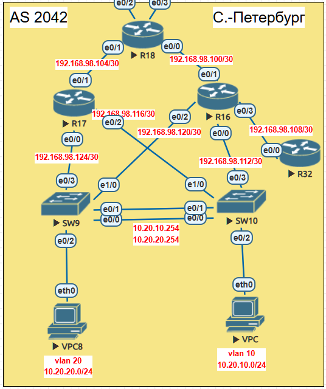

# Лабораторная работа: EIGRP в офисе Санкт-Петербург

## **Тема работы**
Настройка EIGRP, использование named EIGRP, суммаризация маршрутов и фильтрация

## **Цель:**
Настроить EIGRP в офисе Санкт-Петербург, используя named EIGRP, настроить суммаризацию маршрутов на R16-R17, настроить получение только default маршрута для R32.

## **Описание/Пошаговая инструкция выполнения домашнего задания:**

1. Настроить EIGRP named-mode в офисе Санкт-Петербург
2. R32 должен получать только маршрут по умолчанию
3. R16-R17 анонсируют только суммарные префиксы
4. Настроить EtherChannel между SW9 и SW10
5. Настроить HSRP между SW9 и SW10 для отказоустойчивости клиентских шлюзов
6. План работы и изменения зафиксированы в документации

---

## **Общая топология сети**


## **Топология сети лабораторной №5**


### **Участники и их роли:**

| Устройство | Роль | Автономная система |
|------------|------|---------------------|
| R16, R17 | Маршрутизаторы распределения, суммаризация | AS 1 |
| R18 | Центральный маршрутизатор | AS 1 |
| R32 | Stub-роутер | AS 1 |
| SW9, SW10 | L3 свитчи, HSRP, EtherChannel | AS 1 |
| VPCS, VPC8 | Клиенты | - |

### **IP-адресация (IPv4):**

| Сеть | Назначение |
|------|------------|
| 10.20.10.0/24 | Клиентская VLAN10 (VPCS) |
| 10.20.20.0/24 | Клиентская VLAN20 (VPC8) |
| 192.168.98.100/30 | R16-R18 |
| 192.168.98.104/30 | R17-R18 |
| 192.168.98.108/30 | R16-R32 |
| 192.168.98.112/30 | R16-SW10 (Vlan98) |
| 192.168.98.116/30 | R17-SW10 (Vlan97) |
| 192.168.98.120/30 | R16-SW9 (Vlan96) |
| 192.168.98.124/30 | R17-SW9 (Vlan95) |
| 192.168.99.0/24 | MGMT VRF |

---

## **План работы и реализация**

### **1. Настройка EIGRP на маршрутизаторах**

#### **1.1. R16 (Named EIGRP, суммаризация)**

```cisco
!
key chain EIGRP-KEY
 key 1
  key-string CISCO
!
interface Ethernet0/0.98
 description P2P_SW10
 encapsulation dot1Q 98
 ip address 192.168.98.113 255.255.255.252
 ip summary-address eigrp 1 10.20.0.0 255.255.0.0
!
interface Ethernet0/1
 description P2P_R18
 ip address 192.168.98.101 255.255.255.252
!
interface Ethernet0/2.96
 description P2P_SW9
 encapsulation dot1Q 96
 ip address 192.168.98.122 255.255.255.252
 ip summary-address eigrp 1 10.20.0.0 255.255.0.0
!
interface Ethernet0/3
 description P2P_R32
 ip address 192.168.98.110 255.255.255.252
!
router eigrp PETERSBURG
 !
 address-family ipv4 unicast autonomous-system 1
  !
  af-interface default
   authentication mode md5
   authentication key-chain EIGRP-KEY
  exit-af-interface
  !
  topology base
  exit-af-topology
  network 192.168.98.100 0.0.0.3
  network 192.168.98.108 0.0.0.3
  network 192.168.98.112 0.0.0.3
  network 192.168.98.120 0.0.0.3
 exit-address-family
!
```

#### **1.2. R17 (Named EIGRP, суммаризация)**

```cisco
!
key chain EIGRP-KEY
 key 1
  key-string CISCO
!
interface Ethernet0/0.95
 description P2P_SW9
 encapsulation dot1Q 95
 ip address 192.168.98.126 255.255.255.252
 ip summary-address eigrp 1 10.20.0.0 255.255.0.0
!
interface Ethernet0/1
 description P2P_R18
 ip address 192.168.98.105 255.255.255.252
!
interface Ethernet0/2.97
 description P2P_SW10
 encapsulation dot1Q 97
 ip address 192.168.98.117 255.255.255.252
 ip summary-address eigrp 1 10.20.0.0 255.255.0.0
!
router eigrp PETERSBURG
 !
 address-family ipv4 unicast autonomous-system 1
  !
  af-interface default
   authentication mode md5
   authentication key-chain EIGRP-KEY
  exit-af-interface
  !
  topology base
  exit-af-topology
  network 192.168.98.104 0.0.0.3
  network 192.168.98.116 0.0.0.3
  network 192.168.98.124 0.0.0.3
 exit-address-family
!
```

#### **1.3. R18 (Центральный маршрутизатор)**

```cisco
!
key chain EIGRP-KEY
 key 1
  key-string CISCO
!
interface Ethernet0/0
 description P2P_R16
 ip address 192.168.98.102 255.255.255.252
!
interface Ethernet0/1
 description P2P_R17
 ip address 192.168.98.106 255.255.255.252
!
interface Ethernet0/2
 description P2P_R24
 ip address 192.168.98.73 255.255.255.252
!
interface Ethernet0/3
 description P2P_R26
 ip address 192.168.98.77 255.255.255.252
!
router eigrp PETERSBURG
 !
 address-family ipv4 unicast autonomous-system 1
  !
  af-interface default
   authentication mode md5
   authentication key-chain EIGRP-KEY
  exit-af-interface
  !
  topology base
   redistribute static
  exit-af-topology
  network 192.168.98.100 0.0.0.3
  network 192.168.98.104 0.0.0.3
 exit-address-family
!
ip route 0.0.0.0 0.0.0.0 Null0
```

#### **1.4. R32 (Stub-роутер, получает только default)**

```cisco
!
key chain EIGRP-KEY
 key 1
  key-string CISCO
!
interface Ethernet0/0
 description P2P_R16
 ip address 192.168.98.109 255.255.255.252
!
router eigrp PETERSBURG
 !
 address-family ipv4 unicast autonomous-system 1
  !
  af-interface default
   authentication mode md5
   authentication key-chain EIGRP-KEY
  exit-af-interface
  !
  topology base
   distribute-list 1 in
  exit-af-topology
  network 192.168.98.108 0.0.0.3
 exit-address-family
!
access-list 1 permit 0.0.0.0
```

**Примечание:** На данной версии IOS команда `stub` не поддерживается в named EIGRP, поэтому фильтрация реализована через `distribute-list`.

---

### **2. Настройка SW9 и SW10**

#### **2.1. EtherChannel между SW9 и SW10**

**SW9:**
```cisco
interface port-channel 1
 switchport trunk encapsulation dot1q
 switchport mode trunk
!
interface range ethernet0/0-1
 channel-group 1 mode active
```

**SW10:**
```cisco
interface port-channel 1
 switchport trunk encapsulation dot1q
 switchport mode trunk
!
interface range ethernet0/0-1
 channel-group 1 mode active
```

#### **2.2. Включение IP routing и EIGRP на SW9 (классический EIGRP)**

```cisco
ip routing
!
key chain EIGRP-KEY
 key 1
  key-string CISCO
!
router eigrp 1
 network 10.20.20.0 0.0.0.255
 network 192.168.98.120 0.0.0.3
 network 192.168.98.124 0.0.0.3
 passive-interface default
 no passive-interface Vlan95
 no passive-interface Vlan96
!
interface Vlan95
 ip authentication mode eigrp 1 md5
 ip authentication key-chain eigrp 1 EIGRP-KEY
!
interface Vlan96
 ip authentication mode eigrp 1 md5
 ip authentication key-chain eigrp 1 EIGRP-KEY
```

#### **2.3. Включение IP routing и EIGRP на SW10 (классический EIGRP)**

```cisco
ip routing
!
key chain EIGRP-KEY
 key 1
  key-string CISCO
!
router eigrp 1
 network 10.20.10.0 0.0.0.255
 network 192.168.98.112 0.0.0.3
 network 192.168.98.116 0.0.0.3
 passive-interface default
 no passive-interface Vlan97
 no passive-interface Vlan98
!
interface Vlan97
 ip authentication mode eigrp 1 md5
 ip authentication key-chain eigrp 1 EIGRP-KEY
!
interface Vlan98
 ip authentication mode eigrp 1 md5
 ip authentication key-chain eigrp 1 EIGRP-KEY
```

**Примечание:** На SW9/SW10 используется классический EIGRP, так как версия IOS на свитчах не поддерживает полный синтаксис named EIGRP.

#### **2.4. HSRP на SW9 и SW10**

**SW9:**
```cisco
interface Vlan10
 ip address 10.20.10.2 255.255.255.0
 standby 10 ip 10.20.10.254
 standby 10 preempt
!
interface Vlan20
 ip address 10.20.20.1 255.255.255.0
 standby 20 ip 10.20.20.254
 standby 20 priority 150
 standby 20 preempt
```

**SW10:**
```cisco
interface Vlan10
 ip address 10.20.10.1 255.255.255.0
 standby 10 ip 10.20.10.254
 standby 10 priority 150
 standby 10 preempt
!
interface Vlan20
 ip address 10.20.20.2 255.255.255.0
 standby 20 ip 10.20.20.254
 standby 20 preempt
```

---

### **3. Настройка клиентов**

**VPCS (VLAN10):**
```bash
ip 10.20.10.10/24 10.20.10.254
```

**VPC8 (VLAN20):**
```bash
ip 10.20.20.10/24 10.20.20.254
```

---

## **Тестирование и проверка**

### **4.1. Проверка EIGRP соседств**

```cisco
R16#show ip eigrp neighbors
EIGRP-IPv4 VR(PETERSBURG) Address-Family Neighbors for AS(1)
H   Address                 Interface              Hold Uptime   SRTT   RTO  Q  Seq
                                                   (sec)         (ms)       Cnt Num
1   192.168.98.121          Et0/2.96                 12 00:01:04 1594  5000  0  4
0   192.168.98.114          Et0/0.98                 13 00:01:04   22   132  0  4
```

```cisco
R17#show ip eigrp neighbors
EIGRP-IPv4 VR(PETERSBURG) Address-Family Neighbors for AS(1)
H   Address                 Interface              Hold Uptime   SRTT   RTO  Q  Seq
                                                   (sec)         (ms)       Cnt Num
1   192.168.98.125          Et0/0.95                 13 00:00:13 1598  5000  0  9
0   192.168.98.118          Et0/2.97                 11 00:00:13   14   100  0  8
```

```cisco
R18#show ip eigrp neighbors
EIGRP-IPv4 VR(PETERSBURG) Address-Family Neighbors for AS(1)
H   Address                 Interface              Hold Uptime   SRTT   RTO  Q  Seq
                                                   (sec)         (ms)       Cnt Num
1   192.168.98.105          Et0/1                    13 00:07:02 1598  5000  0  10
0   192.168.98.101          Et0/0                    10 00:07:02   12   100  0  16
```

```cisco
R32#show ip eigrp neighbors
EIGRP-IPv4 VR(PETERSBURG) Address-Family Neighbors for AS(1)
H   Address                 Interface              Hold Uptime   SRTT   RTO  Q  Seq
                                                   (sec)         (ms)       Cnt Num
0   192.168.98.110          Et0/0                    14 00:06:46   11   100  0  18
```

```cisco
SW10#show ip eigrp neighbors
EIGRP-IPv4 Neighbors for AS(1)
H   Address                 Interface              Hold Uptime   SRTT   RTO  Q  Seq
                                                   (sec)         (ms)       Cnt Num
1   192.168.98.117          Vl97                     13 00:00:26    2   100  0  6
0   192.168.98.113          Vl98                     14 00:10:20   10   100  0  10
```

**✅ Результат:** Все EIGRP соседства установлены.

---

### **4.2. Проверка получения default маршрута на R32**

```cisco
R32#show ip route eigrp
Gateway of last resort is 192.168.98.110 to network 0.0.0.0

D*EX  0.0.0.0/0 [170/1536512] via 192.168.98.110, 00:00:19, Ethernet0/0
```

**✅ Результат:** R32 получает только default маршрут.

---

### **4.3. Проверка суммаризации на R18**

```cisco
R18#show ip route eigrp | include 10.20
D        10.20.10.0 [90/1541120] via 192.168.98.105, 00:07:08, Ethernet0/1
D        10.20.20.0 [90/1541120] via 192.168.98.105, 00:07:08, Ethernet0/1
```

**✅ Результат:** R18 видит суммарные маршруты 10.20.10.0/24 и 10.20.20.0/24.

---

### **4.4. Проверка EtherChannel**

```cisco
SW9#show etherchannel summary
Group  Port-channel  Protocol    Ports
------+-------------+-----------+-----------------------------------------------
1      Po1(SU)         LACP      Et0/0(P)    Et0/1(P)

SW10#show etherchannel summary
Group  Port-channel  Protocol    Ports
------+-------------+-----------+-----------------------------------------------
1      Po1(SU)         LACP      Et0/0(P)    Et0/1(P)
```

**✅ Результат:** EtherChannel работает, оба порта в bundled состоянии.

---

### **4.5. Проверка HSRP**

```cisco
SW9#show standby brief
Interface   Grp  Pri P State   Active          Standby         Virtual IP
Vl10        10   100 P Standby 10.20.10.1      local           10.20.10.254
Vl20        20   150 P Active  local           10.20.20.2      10.20.20.254

SW10#show standby brief
Interface   Grp  Pri P State   Active          Standby         Virtual IP
Vl10        10   150 P Active  local           10.20.10.2      10.20.10.254
Vl20        20   100 P Standby 10.20.20.1      local           10.20.20.254
```

**✅ Результат:** SW10 Active для Vlan10, SW9 Active для Vlan20.

---

### **4.6. Проверка связности клиентов**

```bash
VPCS> ping 10.20.10.254
84 bytes from 10.20.10.254 icmp_seq=1 ttl=255 time=1.076 ms
84 bytes from 10.20.10.254 icmp_seq=2 ttl=255 time=1.608 ms

VPCS> ping 10.20.20.10
84 bytes from 10.20.20.10 icmp_seq=1 ttl=63 time=5.041 ms
84 bytes from 10.20.20.10 icmp_seq=2 ttl=63 time=3.314 ms

VPC8> ping 10.20.20.254
84 bytes from 10.20.20.254 icmp_seq=1 ttl=255 time=0.912 ms
84 bytes from 10.20.20.254 icmp_seq=2 ttl=255 time=0.977 ms

VPC8> ping 10.20.10.10
84 bytes from 10.20.10.10 icmp_seq=1 ttl=63 time=4.418 ms
84 bytes from 10.20.10.10 icmp_seq=2 ttl=63 time=2.933 ms
```

**✅ Результат:** Клиенты имеют связность между собой и с HSRP виртуальными шлюзами.

---

## **Выводы**

В ходе лабораторной работы были выполнены следующие задачи:

1. ✅ **EIGRP named-mode настроен** — AS 1 (R16,R17,R18,R32)
2. ✅ **R32 получает только default маршрут** (distribute-list)
3. ✅ **R16-R17 анонсируют суммарные префиксы** (10.20.0.0/16)
4. ✅ **EtherChannel между SW9 и SW10** настроен и работает
5. ✅ **HSRP между SW9 и SW10** настроен (SW10 Active для Vlan10, SW9 Active для Vlan20)
6. ✅ **Клиенты имеют связность** через HSRP виртуальные шлюзы
7. ✅ **Аутентификация EIGRP** настроена (MD5)

