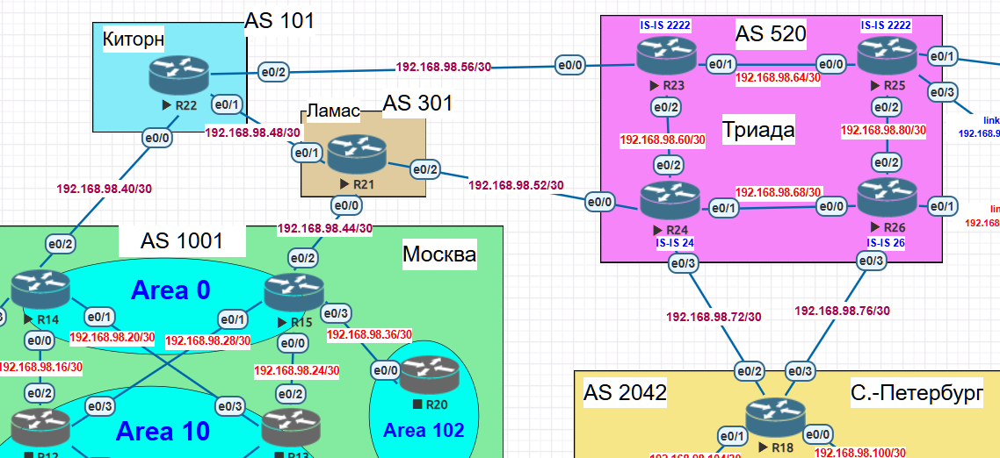

# Лабораторная работа: iBGP

## **Тема работы**
Настройка iBGP в офисе Москва и в сети провайдера Триада с использованием Route Reflector. Организация полной IP-связности всех сетей.

## **Цель**
1. Настроить iBGP в офисе Москва между маршрутизаторами R14 и R15
2. Настроить iBGP в провайдере Триада с использованием Route Reflector (RR)
3. Настроить приоритет провайдера Ламас для офиса Москва
4. Настроить балансировку трафика в офисе С.-Петербург по двум линкам
5. Обеспечить полную IP-связность всех клиентских сетей

---

## **Общая топология сети**


## **Топология сети лабораторной №5**


### **Участники и их роли**

| Устройство | Роль | Автономная система |
|:---|:---|:---:|
| R14, R15 | Пограничные роутеры офиса Москва | AS 1001 |
| R12, R13 | ABR между Area 0 и Area 10 (Москва) | — |
| SW4, SW5 | L3-свитчи, шлюзы клиентов (Москва) | — |
| VPC1, VPC7 | Клиенты Москвы | — |
| R22 | Провайдер Киторн | AS 101 |
| R21 | Провайдер Ламас | AS 301 |
| R23, R24, R25, R26 | Провайдер Триада | AS 520 |
| R18 | Пограничный роутер офиса С.-Петербург | AS 2042 |
| R16, R17 | Маршрутизаторы распределения (Питер) | — |
| SW9, SW10 | L3-свитчи, шлюзы клиентов (Питер) | — |
| VPCS, VPC8 | Клиенты С.-Петербурга | — |

---

## **План работы и реализация**

### **1. Настройка iBGP в офисе Москва (AS 1001)**

#### **1.1. Создание Loopback-интерфейсов для iBGP**

**R14:**
```cisco
interface Loopback0
 description iBGP_Router_ID
 ip address 14.14.14.14 255.255.255.255
!
router ospf 1
 network 14.14.14.14 0.0.0.0 area 0
```

**R15:**
```cisco
interface Loopback0
 description iBGP_Router_ID
 ip address 15.15.15.15 255.255.255.255
!
router ospf 1
 network 15.15.15.15 0.0.0.0 area 0
```

#### **1.2. Настройка iBGP-соседства**

**R14:**
```cisco
router bgp 1001
 neighbor 15.15.15.15 remote-as 1001
 neighbor 15.15.15.15 description iBGP_to_R15
 neighbor 15.15.15.15 update-source Loopback0
 neighbor 15.15.15.15 next-hop-self
 !
 address-family ipv4
  neighbor 15.15.15.15 activate
```

**R15:**
```cisco
router bgp 1001
 neighbor 14.14.14.14 remote-as 1001
 neighbor 14.14.14.14 description iBGP_to_R14
 neighbor 14.14.14.14 update-source Loopback0
 neighbor 14.14.14.14 next-hop-self
 !
 address-family ipv4
  neighbor 14.14.14.14 activate
```

#### **1.3. Проверка iBGP-соседства**

```
R14# show ip bgp summary
BGP router identifier 14.14.14.14, local AS number 1001

Neighbor        V           AS MsgRcvd MsgSent   TblVer  InQ OutQ Up/Down  State/PfxRcd
15.15.15.15     4         1001      64      68       73    0    0 00:00:44        7
192.168.98.41   4          101     211     215       73    0    0 03:04:31        7
```

✅ iBGP-сессия между R14 и R15 установлена.

---

### **2. Приоритет провайдера Ламас (AS 301) для офиса Москва**

Для предпочтения провайдера Ламас настроена **Local Preference = 200** на R14 для маршрутов от R15.

#### **2.1. Конфигурация R14**

```cisco
route-map SET_LP permit 10
 set local-preference 200
!
router bgp 1001
 address-family ipv4
  neighbor 15.15.15.15 route-map SET_LP in
```

#### **2.2. Проверка приоритета**

```
R14# show ip bgp 192.168.98.72
BGP routing table entry for 192.168.98.72/30, version 15
Paths: (2 available, best #1, table default)
  301 520
    15.15.15.15 (metric 21) from 15.15.15.15 (15.15.15.15)
      Origin IGP, metric 0, localpref 200, valid, internal, best
  101 301 520
    192.168.98.41 from 192.168.98.41 (22.22.22.22)
      Origin IGP, localpref 100, valid, external
```

✅ Best path через R15 (Ламас) с `localpref 200`.

---

### **3. Настройка iBGP в Триаде (AS 520) с Route Reflector**

#### **3.1. Создание Loopback-интерфейсов и добавление в ISIS**

**R23, R24, R25, R26:**
```cisco
interface Loopback0
 description iBGP_Router_ID
 ip address X.X.X.X 255.255.255.255
 ip router isis
!
router isis
 passive-interface Loopback0
```

| Роутер | Loopback IP |
|:---|:---|
| R23 | 23.23.23.23 |
| R24 | 24.24.24.24 |
| R25 | 25.25.25.25 |
| R26 | 26.26.26.26 |

#### **3.2. Настройка Route Reflector (R24)**

```cisco
router bgp 520
 neighbor 23.23.23.23 remote-as 520
 neighbor 23.23.23.23 description iBGP_client_R23
 neighbor 23.23.23.23 update-source Loopback0
 neighbor 23.23.23.23 route-reflector-client
 neighbor 23.23.23.23 next-hop-self
 !
 neighbor 25.25.25.25 remote-as 520
 neighbor 25.25.25.25 description iBGP_client_R25
 neighbor 25.25.25.25 update-source Loopback0
 neighbor 25.25.25.25 route-reflector-client
 neighbor 25.25.25.25 next-hop-self
 !
 neighbor 26.26.26.26 remote-as 520
 neighbor 26.26.26.26 description iBGP_client_R26
 neighbor 26.26.26.26 update-source Loopback0
 neighbor 26.26.26.26 route-reflector-client
 neighbor 26.26.26.26 next-hop-self
```

#### **3.3. Настройка клиентов RR**

**R23:**
```cisco
router bgp 520
 neighbor 24.24.24.24 remote-as 520
 neighbor 24.24.24.24 description iBGP_to_RR_R24
 neighbor 24.24.24.24 update-source Loopback0
 neighbor 24.24.24.24 next-hop-self
```

**R25:**
```cisco
router bgp 520
 neighbor 24.24.24.24 remote-as 520
 neighbor 24.24.24.24 description iBGP_to_RR_R24
 neighbor 24.24.24.24 update-source Loopback0
 neighbor 24.24.24.24 next-hop-self
```

**R26:**
```cisco
router bgp 520
 neighbor 24.24.24.24 remote-as 520
 neighbor 24.24.24.24 description iBGP_to_RR_R24
 neighbor 24.24.24.24 update-source Loopback0
 neighbor 24.24.24.24 next-hop-self
```

#### **3.4. Проверка iBGP в Триаде**

```
R24# show ip bgp summary
BGP router identifier 24.24.24.24, local AS number 520

Neighbor        V           AS MsgRcvd MsgSent   TblVer  InQ OutQ Up/Down  State/PfxRcd
23.23.23.23     4          520      13      14       14    0    0 00:02:51        5
25.25.25.25     4          520      11       5       14    0    0 00:01:45       12
26.26.26.26     4          520       9      15       14    0    0 00:02:38        1
192.168.98.53   4          301     249     251       14    0    0 03:39:10        7
192.168.98.73   4         2042     250     250       14    0    0 03:39:00        2
```

✅ Все iBGP-сессии установлены.

---

### **4. Настройка балансировки трафика в офисе С.-Петербург (AS 2042)**

R18 подключён к Триаде двумя линками (R24 и R26). Для распределения трафика настроен `maximum-paths 2`.

#### **4.1. Конфигурация R18**

```cisco
router bgp 2042
 address-family ipv4
  maximum-paths 2
```

#### **4.2. Проверка балансировки**

```
R18# show ip route 10.10.10.0
Routing entry for 10.10.10.0/24
  Known via "bgp 2042", distance 20, metric 0
    192.168.98.78, from 192.168.98.78, traffic share count is 1
  * 192.168.98.74, from 192.168.98.74, traffic share count is 1
```

```
R18# traceroute 10.10.10.10
  1 192.168.98.74 6 msec
    192.168.98.78 1 msec
    192.168.98.74 1 msec
  2 192.168.98.69 2 msec
    192.168.98.53 [AS 520] 3 msec
    ...
```

✅ Трафик распределяется по обоим линкам.

---

### **5. Обеспечение IP-связности клиентских сетей**

#### **5.1. Анонсирование сетей Москвы в BGP**

**R14 и R15:**
```cisco
router bgp 1001
 address-family ipv4
  network 10.10.10.0 mask 255.255.255.0
  network 10.10.20.0 mask 255.255.255.0
```

#### **5.2. Анонсирование сетей С.-Петербурга в BGP**

**R18:**
```cisco
router bgp 2042
 address-family ipv4
  network 10.20.10.0 mask 255.255.255.0
  network 10.20.20.0 mask 255.255.255.0
```

#### **5.3. Редистрибуция BGP в OSPF (Москва)**

**R14 и R15:**
```cisco
router ospf 1
 redistribute bgp 1001 subnets
```

#### **5.4. Исправление OSPF Area 10**

На R12 и R13 убран `no-summary` для передачи межзонных маршрутов:

```cisco
router ospf 1
 no area 10 stub no-summary
 area 10 stub
```

#### **5.5. Проверка связности клиентов**

**Москва → Питер:**
```
VPC1> ping 10.20.20.10
84 bytes from 10.20.20.10 icmp_seq=1 ttl=55 time=12.821 ms
84 bytes from 10.20.20.10 icmp_seq=2 ttl=55 time=20.397 ms

VPC7> ping 10.20.10.10
84 bytes from 10.20.10.10 icmp_seq=1 ttl=55 time=12.442 ms
84 bytes from 10.20.10.10 icmp_seq=2 ttl=55 time=15.437 ms
```

**Питер → Москва:**
```
VPC8> ping 10.10.10.10
84 bytes from 10.10.10.10 icmp_seq=1 ttl=55 time=15.278 ms

VPCS> ping 10.10.20.10
84 bytes from 10.10.20.10 icmp_seq=1 ttl=55 time=17.156 ms
```

✅ Полная IP-связность всех клиентских сетей обеспечена.

---

### **6. Трассировки маршрутов**

**VPC7 → VPCS (10.20.10.10):**
```
VPC7> trace 10.20.10.10
 1   10.10.20.1 (SW4)
 2   192.168.98.13 (R13)
 3   192.168.98.26 (R15)
 4   192.168.98.46 (R21 - Ламас)
 5   192.168.98.54 (R24 - Триада)
 6   192.168.98.73 (R18 - Питер)
 7   192.168.98.105 (R17)
 8   192.168.98.118 (SW10)
```

**VPC7 → VPC8 (10.20.20.10):**
```
VPC7> trace 10.20.20.10
 1   10.10.20.1 (SW4)
 2   192.168.98.13 (R13)
 3   192.168.98.26 (R15)
 4   192.168.98.46 (R21 - Ламас)
 5   192.168.98.54 (R24 - Триада)
 6   192.168.98.73 (R18 - Питер)
 7   192.168.98.101 (R16)
 8   192.168.98.121 (SW9)
```

✅ Маршруты проходят через приоритетного провайдера Ламас (AS 301).

---

## **Выводы**

В ходе лабораторной работы были выполнены следующие задачи:

1. ✅ **iBGP в офисе Москва настроен** — R14 ↔ R15 через Loopback0
2. ✅ **iBGP в Триаде с RR настроен** — R24 как Route Reflector, R23/R25/R26 как клиенты
3. ✅ **Приоритет провайдера Ламас настроен** — Local Preference = 200 на R14
4. ✅ **Балансировка в Питере настроена** — maximum-paths 2 на R18
5. ✅ **Полная IP-связность всех сетей обеспечена** — пинги между всеми VPC успешны

**Дополнительно:**
- В офисе Москва используется OSPF (Area 0, Area 10 stub, Area 101 stub)
- В офисе С.-Петербург используется EIGRP (AS 1, named mode)
- В Триаде используется ISIS (Level-2 only) для внутренней маршрутизации
- BGP анонсирует клиентские сети и P2P-стыки между AS

